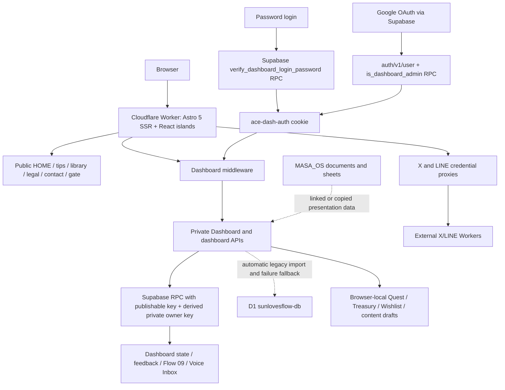
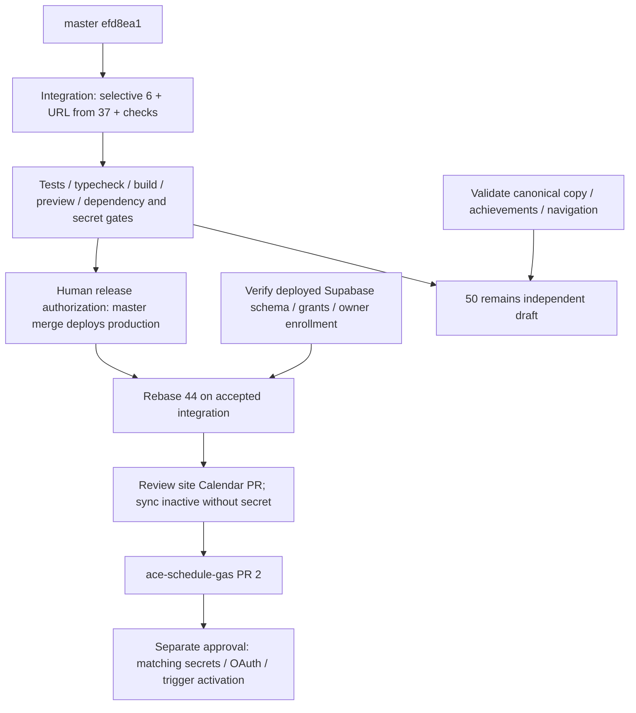

# Release integration evidence — 2026-09-07

> Historical audit. Current release state and corrected evidence are in [the refreshed receipt](release-conductor-2026-09-08.md). PR #55 has since been merged and deployed by a separately authorized release action. The NO-GO and not-checked statements below describe the original audit only.

Status: **NO-GO for production** until the gates below are satisfied. No deployment,
secret change, DNS change, database migration, PR merge or PR closure is performed
by this work. This is a derived engineering report, not a new operational canon.

## Evidence boundary

- Audited master: `efd8ea1c2de9996ba0f64741449acb78a3c7fbf7`.
- GitHub deployment run [34123034985](https://github.com/takraw369/masahiro-yamada-com/actions/runs/34123034985)
  reports successful build/deploy for that SHA. The active Cloudflare version,
  remote bindings, OAuth redirect allowlist and database schema were not independently
  inspected. A successful workflow is evidence of a deployment attempt succeeding,
  not complete production provenance or runtime correctness.
- Master contains no README, docs directory, architecture document or test suite.
  `DESIGN.md` is a visual guide, not a runtime canon; its Astro 6+ statement disagrees
  with the locked Astro 5 stack. The implementation evidence below takes precedence
  for describing what the code does, not for redefining organizational policy.
- #50 cites MASA_CORE_MAP, a May 13 story and WEB_SYSTEM_CANONICAL by name only;
  their contents are not in this repository. Their claims are not treated as verified.
- Existing checkout is on `main`, with a modified `wrangler.jsonc` and an untracked
  Tips file. Those files and all existing worktrees were preserved. Integration
  starts from remote master in a separate worktree, not that local configuration.

## Reconstructed production architecture (audited master)

- `wrangler.toml` names the production Worker, `dist/_worker.js/index.js`, ASSETS,
  five root custom domains, D1 binding `DB`, Supabase project URL and publishable key,
  and X/LINE upstream URLs. Middleware redirects known legacy/www hosts to the
  unhyphenated canonical host while preserving path/query. Some www routes exist
  only in middleware comments pending external nameserver cutover; no DNS inference.
- `astro.config.mjs` deliberately stubs React server rendering; pages normally use
  `client:only="react"`. `scripts/patch-worker.mjs` also adds a MessageChannel shim.
  Neither workaround is removed without a Worker runtime validation.
- Auth: database password verification and Google-admin checks converge on a cookie.
  `DASHBOARD_PASSWORD` is actually the stable signing/owner-derivation secret, not
  the resettable login password. Reset changes `private.dashboard_login_credentials`.
  Never rotate this Worker secret as a casual password reset: it changes owner keys.
- Master's token is a deterministic purpose-separated HMAC. #49 refreshes cookie
  Max-Age only; there is no signed server-side expiry. #52 bypasses middleware only
  for Google-login/reset-password bootstrap and removes the double-login flash.
- State and feedback handlers import from D1 during GET and fall back to D1 on
  Supabase errors; public funnel ingestion also falls back. These are active code
  paths, not dead migrations. D1 writes after a completed one-time migration can
  diverge from Supabase and never be reconciled by the existing marker.
- Voice Inbox (#53) uses owner-allowlisted RPCs over `os_feedback`, not a new inbox
  table. Google admin role checks use `user_roles`; no editable user_metadata auth
  was found. Owner-key capabilities are not Supabase user sessions.
- Flow 09 stores notes in Supabase plus a local browser fallback; the linked Drive
  model is interpretation/context. This is not evidence of a synchronized document.
- `/dashboard/schedule` renders **ContentScheduler** (X/LINE content drafts), despite
  the navigation saying Calendar. No Google Calendar read/sync endpoint exists on master.
- Quest/Treasury/Wishlist/content drafts are browser-local, not centrally backed up.
  `/dashboard/graph` embeds node/edge arrays and lets the user alter an in-memory
  graph; it is not a live Drive knowledge graph. Dashboard Center Pins are embedded
  priorities, not a TASK_BOARD integration. Preserve these assets but label their role.
- `ACECalendar.tsx` is unreferenced by current routes/imports (code search); it still
  contains local themes and state/feedback fetches. Keep it until legacy-data usage
  is resolved. Its stale schedule model is not Google Calendar truth.

## PR decisions and overlap

| PR / audited head | Decision | Evidence and disposition |
| --- | --- | --- |
| [#37](https://github.com/takraw369/masahiro-yamada-com/pull/37) `bcfb871` | **PORT → SUPERSEDE** | Port the still-stale Website URL. The rest is a priority card/grid change, not an auth implementation. #34/#49/#52 already implement login/recovery improvements. An authenticated link to `/dashboard/login` immediately redirects back, so porting that card does not create a useful reset flow. Retain current VisualPromptCards and current priorities. Close #37 only after the replacement is accepted, not automatically. |
| [#44](https://github.com/takraw369/masahiro-yamada-com/pull/44) `b4614ec` | **REBASE** | Keep the one-way Google Calendar snapshot concept and preserve ContentScheduler under content-schedule. GitHub reports CONFLICTING. Its middleware change must be combined with #52 bootstrap exceptions and the new session/CSRF boundary, with only the exact Bearer sync endpoint exempted. Do not restore the old whole middleware. Requires the gates below. |
| [#50](https://github.com/takraw369/masahiro-yamada-com/pull/50) `90d75f0` | **KEEP (draft)** | GitHub reports MERGEABLE. Public-only HOME/layout/story/profile/philosophy changes; independent of auth/calendar. Replaces the homepage and shared public navigation, not only an additive profile. External source prose, result claims and removed homepage CTA/navigation need owner review; keep separate from security integration. |
| [#6](https://github.com/takraw369/masahiro-yamada-com/pull/6) `d2e328c` | **PORT; keep CLOSED** | Do not merge the 84-file old branch or its D1-era state layer, new vault/public routes, framework major bump, old canonical host, operator-secret model. #26 superseded the fixed-cookie vulnerability partially, #25 changed storage to Supabase, #28 hardened public Tips, and CI already carries some pinned actions. Expiring server sessions, authenticated constrained proxies and isolated Worker smoke coverage were still missing; adapted here. Full operator/rate-limit model is not silently claimed as ported. |

File overlap: #6/#44 touch middleware and storage/auth boundaries; #6/#37 both
touch Dashboard-facing code; #6/#50 both touch HOME/public architecture. #37 and
#44/#50 have no direct changed-file intersection, but #37's priority prose is
stale relative to the later auth fixes. Merge-base ages are `d2c467c` (#37),
`602690b` (#44), `dd217d6` (#50), `d479dbb` (#6). #50's displayed base SHA is newer
than its actual common ancestor; comparisons use merge-base, not just PR metadata.

## Dependency graph and merge order

Suggested order is integration first, corrected #44 site code second, companion GAS
code third, #50 when its editorial gate passes (can be reviewed in parallel; no
technical dependency on Calendar). Secret/trigger activation is a separate operation.
#37 is superseded only after its surviving change lands; #6 stays closed. **No PR
can be merged in this task because current master pushes auto-deploy production.**

## Calendar-specific blockers before #44 merge

1. PR says its migration was already applied, but no remote schema evidence is
   attached. Verify actual functions/tables and avoid blindly reapplying edited SQL.
2. Snapshot tables revoke grants but do not enable RLS. RPCs granted to anon and
   authenticated validate only owner-key format. Preserve private owner capability;
   reconcile with Voice Inbox's canonical owner allowlist, and enable RLS through
   a reviewed additive migration. No new secret/service-role browser exposure.
3. `PersonalSchedule client:load` conflicts with the no-op React SSR renderer; port
   using the established client-only island contract and verify actual rendered UI.
4. Sync JSON `null` or null events can throw before validation. Validate object
   shapes, byte bounds, event ranges, duplicate event IDs, booleans, window limits,
   recurring instances, and sanitized errors before replacing the snapshot.
5. Test concurrent whole-snapshot replacement and freshness ordering; deletion and
   insert alone do not establish a serialized per-owner snapshot contract.
6. [ace-schedule-gas #2](https://github.com/takraw369/ace-schedule-gas/pull/2), head
   `4f44692`, is still OPEN. OAuth readonly scope, matching CALENDAR_SYNC_SECRET and
   trigger setup are separate activation dependencies. No `schedule-data.js` exists
   on master; do not recreate it as another source of truth.

## Integration changes and release gates

- Signed v2 sessions include random nonce, server-checked 24-hour expiry and origin
  audience. Renewal signs a fresh token. Old fixed tokens require one login after
  release. Password and Google-admin entry paths share this implementation. Stable
  storage-owner HMAC remains unchanged; no secret mutation or data migration.
- X/LINE proxies now independently require a valid session, check mutation Origin,
  allow only existing UI-used method/path/payload combinations, bound streams,
  reject upstream redirects and sanitize failures. Private responses are no-store.
- #6's full operator elevation and distributed rate limiting remain unported:
  existing authenticated admins retain posting rights. Password reset/logout do not
  revoke other already-issued sessions immediately; expiry limits them. Record this
  limitation before choosing a broader session-store or credential-epoch migration.
- Remove build/dev's retired-vault sync hooks, keep no-op compatibility entry point.
  No content or user files deleted. Build now consumes reviewed committed exports.
- Isolated local Worker preview uses empty bindings, empty dev vars and an
  allowlisted process environment. Astro dev does not load production bindings.
  Hosted preview is not configured or verified. Do not upload production-bound
  versions as a substitute for an isolated preview environment.
- Pin deploy actions and Wrangler; run regressions, typecheck, preview and security
  checks in CI. Strict branch protection currently requires test-and-build and
  secret-scan, including administrators. Deployment also runs verification.
- Baseline production dependency audit: 25 findings (15 high, 6 moderate, 4 low).
  Compatible lockfile updates are attempted; unresolved audit results remain blocking.
  Do not force a framework major upgrade by copying #6's dependency tree.
- Local dependency installation failed twice with ENOSPC. Only this task's partial
  node_modules was removed. Local typecheck/build could not start (`astro` missing).
  Node-native security tests pass; CI results must be recorded before acceptance.
- Before production readiness: resolve dependency advisories; establish remote
  schema/grants and foundational migration provenance (state v2, password verifier,
  credentials table and os_feedback definitions are missing here); reconcile D1
  fallback writes/import markers; verify Google login/reset end-to-end on isolated
  non-production configuration. No database contents or secrets are invented.

Reference checks: [Cloudflare configuration](https://developers.cloudflare.com/workers/wrangler/configuration/),
[Workers best practices](https://developers.cloudflare.com/workers/best-practices/workers-best-practices/),
[Supabase RLS](https://supabase.com/docs/guides/database/postgres/row-level-security).
